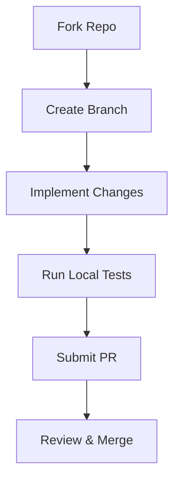

# Contributing to this Project

Thank you for your interest in contributing! We welcome and appreciate all forms of contributions—whether you are writing code, fixing typos, refining documentation, or proposing new features. 

This guide outlines the standard workflow and guidelines for submitting contributions.

---

## 🗺️ Ways to Contribute

You can help improve this project in several ways:

1. **Bug Reports & Feature Requests**: If you find an issue or have an idea, let us know! (See [REPORTING.md](REPORTING.md) for details).
2. **Code Implementation**: Fix open bugs, implement requested features, or optimize performance.
3. **Documentation**: Improve readability, fix grammatical errors, or add clear examples.
4. **Community Support**: Help other users by answering questions and participating in discussions.

---

## 🛠️ Contribution Workflow

We follow a standard fork-and-pull model:



### 1. Set Up Your Environment
1. **Fork** the repository to your own GitHub account.
2. **Clone** your fork locally:
   ```bash
   git clone https://github.com/YOUR-USERNAME/PROJECT-NAME.git
   cd PROJECT-NAME
   ```
3. Set up the upstream remote to stay synchronized with the main repository:
   ```bash
   git remote add upstream https://github.com/ORIGINAL-OWNER/PROJECT-NAME.git
   ```

### 2. Branching Strategy
Always create a descriptive branch name from the main branch. Do not work directly on `main`:
- Features: `feature/descriptive-name`
- Bugfixes: `bugfix/descriptive-name`
- Documentation: `docs/descriptive-name`
- Performance/Refactoring: `refactor/descriptive-name`

```bash
git checkout -b feature/descriptive-branch-name
```

### 3. Writing Code & Documentation
- Maintain consistent coding style with the existing codebase.
- Keep changes concise, focused, and minimal. Avoid bundling unrelated fixes together.
- Update relevant documentation and comments if you introduce new capabilities or edit existing workflows.

### 4. Commit Messages
Commit messages should be descriptive and conventional. Focus on the *why* as well as the *what*:
- Use the imperative mood (e.g., `feat: add relative time parsing` instead of `added relative time parsing`).
- Prefix your commits when applicable:
  - `feat:` (New feature)
  - `fix:` (Bug fix)
  - `docs:` (Documentation changes)
  - `style:` (Formatting, missing semi-colons, no code change)
  - `refactor:` (Refactoring production code)
  - `test:` (Adding or correcting tests)

---

## 🔍 Pull Request Checklist

Before submitting your pull request, verify that:
- [ ] Your code compiles/runs without errors.
- [ ] All automated tests pass successfully.
- [ ] No temporary debugging console logs or comments remain.
- [ ] The documentation is updated to match your changes.
- [ ] Your branch is rebased on the latest `upstream/main` to avoid merge conflicts.

Once ready, open your PR with a clear title and description detailing:
- The problem you are solving (reference issue numbers if any).
- Your implementation approach.
- Any critical testing steps you took.

---

## 🤝 Code of Conduct

We are committed to fostering a welcoming, respectful, and safe community for everyone. When contributing, please ensure to:
- Be respectful and professional.
- Focus discussions on the project and the technical implementation.
- Remain open to constructive feedback.

Thank you for helping us make this project better!
